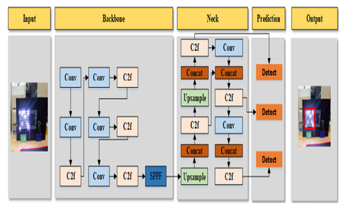
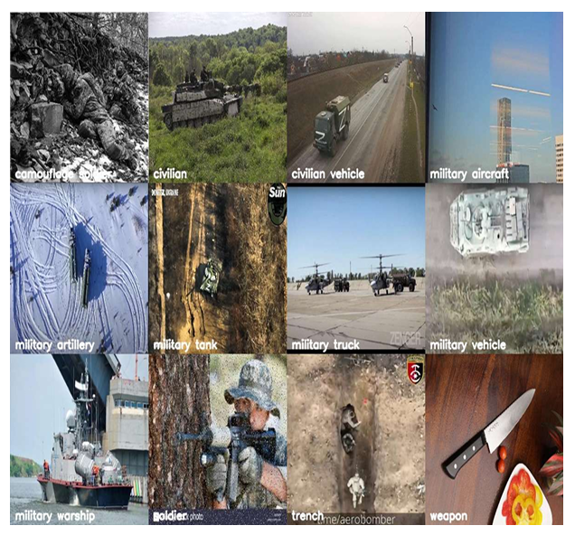
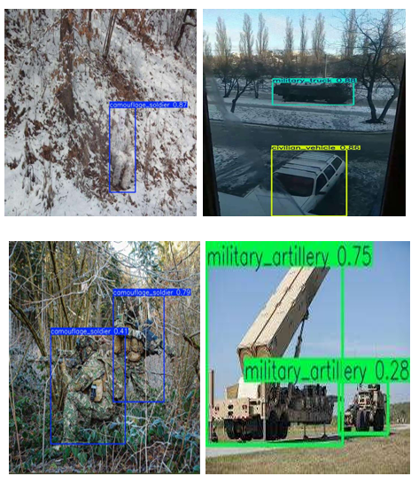
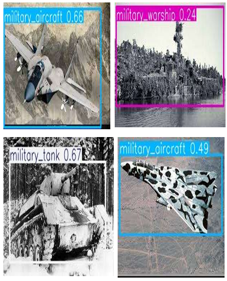

# Ghillie Suit Camouflaged Personnel Detection (YOLOv8)

Flask-based web app for image upload and live webcam detection of personnel wearing ghillie suits. Uses a custom YOLOv8 model, a LandingLens-inspired UI, prioritized model loading (`models/best.pt`), and API endpoints for live detection.


## Project Highlights
- YOLOv8 custom model with prioritized load order (`models/best.pt` → fallback `yolov8n.pt`).
- Live detection via `/api/live_detect` (base64 frames) with annotated frame return.
- Upload workflow with extension/mimetype checks and 16 MB limit.
- Clean structure with blueprints and service layer:
  - `app/` (factory, routes, services)
  - `templates/`, `static/`
  - `models/` (place `best.pt`)
- LandingLens-inspired frontend (minimal, light theme).

## Repository Structure
```
.
├─ app/
│  ├─ __init__.py          # app factory, config load, blueprints
│  ├─ routes/
│  │  ├─ web.py            # HTML routes (/ , /model_info, /performance, /predict)
│  │  └─ api.py            # JSON API (/api/live_detect, /api/status)
│  └─ services/
│     └─ model_service.py  # YOLO load, inference, base64 decode
├─ static/
│  ├─ css/, js/, images/   # assets and provided diagrams/figures
│  └─ uploads/             # runtime annotated outputs
├─ templates/              # Jinja2 templates
├─ models/                 # place best.pt here
├─ app.py                  # entrypoint (uses create_app)
├─ config.py               # Dev/Prod configs (env-driven)
├─ requirements.txt
└─ tests/ (suggested)      # add pytest-based API checks
```

## Quickstart (Local)

**📖 For troubleshooting and deployment help, see [TROUBLESHOOTING.md](TROUBLESHOOTING.md) and [RENDER_DEPLOYMENT_FIX.md](RENDER_DEPLOYMENT_FIX.md).**

Quick start:

1) **Python env**
```bash
python -m venv venv
venv\Scripts\activate   # on Windows
# or: source venv/bin/activate
```

2) **Install dependencies**
```bash
pip install -r requirements.txt
pip install ultralytics   # if not pinned in requirements.txt
```

3) **Add your model**
- Place `best.pt` in `models/` (included in this repo, or use your own trained weights).

4) **Run**
```bash
python app.py
# Visit: http://127.0.0.1:5000/predict
```

## API
- `POST /api/live_detect`
  - Body (JSON): `{ "image": "data:image/jpeg;base64,...." }`
  - Response: `{ success, detections, count, annotated_image }`
- `GET /api/status`
  - Returns `{ model_loaded: bool }`

## Security & Safety
- `SECRET_KEY` and limits from env (`config.py`); defaults provided for dev.
- Upload hardening: extension & mimetype checks; 16 MB cap.
- Model caching avoids reload on each request.

## Ethics & Responsible Use
This project detects personnel in ghillie-suit camouflage and is intended for **research and educational use only**. Do not deploy it for surveillance, weapon targeting, or other harmful applications without appropriate legal review and oversight.

## License
Released under the [MIT License](LICENSE).

## Model & Pipeline Visuals

Architecture (YOLOv8 Backbone/Neck/Head):


Dataset examples:




Confusion matrix:


Confidence curve:


Precision-Recall curve:


Precision-Confidence matrix:


